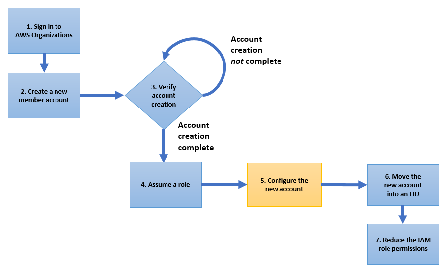

# aws-account-vending-machine
**AWS Account Vending Machine using Step function:**
 This solution helps to automate end-to-end account creation in Organizations as well as how to automate resources provisioning on the newly vended account. Also, submit the AWS Support case to include the newly Created Account to the Enterprise/Primium Support Plan. End of the workflow, the newly vended Account will be move into an organizational unit (OU) to apply the SCP controls.

## Required Resources:
1. **02 Step Function (refer 100-, 200- folders)**
2. **IAM Role for Step Function to do the Account Creation and Moving into the respective given OU.**
3. **Payload for step function execution and Cloudformation template for IAM role creation in the new AWS account which gonna be created.**
4. **SNS Topic for Sending Notifications.**
5. **CloudFormation Template for IAM Roles creation for new AWS Account booststrap from Pipeline.**


## Deployment Steps:
1. Setup the "100-Check-If-Account-Exist" Stepfunction first.

.png)


2. Setup the "200-Create-Account-If-Not-Exist" StepFunction and integrate both.
.png)

3. Setup SNS Topic to send notifications from the both statemachines related to AWS accounts and the exection status.


## Payload for First (100) StepFunction to execute:
```
{
    "OU": "Sandbox",
    "AccountName": "Sandbox5 Account",
    "AccountEmail": "ashokkalakoti+codetoimpact12023@cloudreinforce.com"
}
```

## workflow:
**Process overview**
The following process flow diagram illustrates the steps required to create an account, configure the account, and then move it into an OU so that the account can take advantage of the centralized SCP functionality in Organizations. The tasks in the blue nodes occur in the master account in the organization in question, and the task in the orange node occurs in the new member account I create
